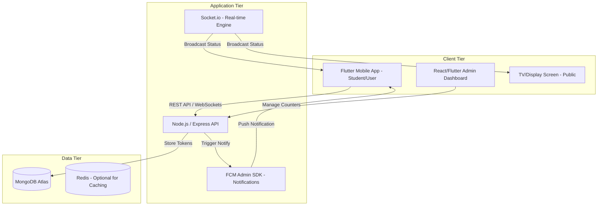

# Smart Queue Management System (SQMS) Architecture

As a senior architect, I've designed a scalable, real-time architecture using **Node.js**, **MongoDB**, and **Flutter**. This system focuses on high availability, real-time synchronization, and a premium UI/UX.

## 1. High-Level Architecture

## 2. Database Schema (MongoDB)

| Collection | Schema Highlights |
| :--- | :--- |
| **Locations** | `name`, `type` (Hospital, Bank), `address`, `coordinates`, `image_url` |
| **Services** | `location_id`, `name`, `counter_prefix` (e.g., 'A'), `avg_service_time` |
| **Counters** | `service_id`, `counter_number`, `staff_id`, `status` (Active/Paused) |
| **Tokens** | `user_id`, `service_id`, `counter_id`, `token_number`, `status` (Waiting, Serving, Completed, Cancelled), `timestamp` |
| **Users** | `name`, `fcm_token`, `email`, `role` (User/Staff) |

## 3. API Endpoints (Node.js)

### User APIs
- `POST /api/tokens/generate`: Register a new token (QR-code based support via `service_id`).
- `GET /api/tokens/live/:token_id`: Get real-time status and estimated wait time.
- `PATCH /api/tokens/cancel/:token_id`: User-initiated cancellation.
- `GET /api/locations`: List of nearby service centers.

### Staff/Admin APIs
- `PATCH /api/counters/next`: Call the next token in the queue.
- `PATCH /api/counters/status`: Toggle counter status (Start/Pause).
- `GET /api/analytics/daily`: Daily stats (Total tokens, Avg wait time).

## 4. Flutter Screen List (Mobile)

1.  **Onboarding**: Modern animation explaining "No more lines".
2.  **Home / Discovery**: Map view & List view of service locations (Rounded cards).
3.  **Service Selection**: Choose specific service (e.g., "General Checkup" vs "X-Ray").
4.  **Token Generation**: QR Scanner or One-click generate.
5.  **Live Ticket View**:
    *   **Main Element**: Large, glowing Current Serving Number.
    *   **Sub Element**: "Your Position: #5", "Est. Wait: 12 mins".
    *   **Progress Bar**: Visual queue progression.
6.  **History**: Past visits and receipts.

## 5. Admin Panel Flow
- **Dashboard**: Real-time ticker showing current tokens across all counters.
- **Counter Control**: A simple "Next" button, "Pause" for breaks, and "Priority Call" for seniors.
- **Display Mode**: A dedicated route `admin/display/:locationId` designed for 1080p TV screens showing the grid of counters and currently serving numbers with voice announcements.

## 6. Advanced Future Upgrades
- **AI Prediction**: Use historic data to predict wait times more accurately during peak hours.
- **Geofencing**: Automatically check-in users when they are within 100m of the building.
- **Multi-language Audio**: Voice announcements for the TV display in local languages.
