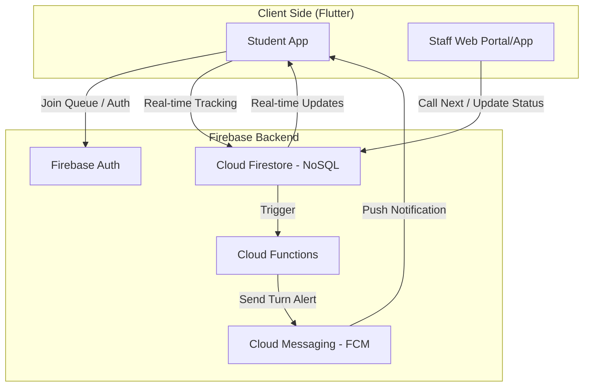

# SQMS: Smart Queue Management System Architecture

Building a real-time, scalable backend using **Firebase**. This architecture ensures low latency for queue updates and reliable notifications for students.

## System Architecture

## Perfect System Flow

1.  **Authentication**: Student logs in via Student ID/Email (Firebase Auth).
2.  **Discovery**: Student browsing list of Services (Firestore: `services` collection).
3.  **Registration**:
    *   Student selects a service and clicks "Join Queue".
    *   Backend generates a unique **Ticket ID** and calculates **Estimated Wait Time**.
4.  **Live Monitoring**: Student sees their "Position in Queue" and "Estimated Wait Time" update in real-time.
5.  **Staff Interaction**:
    *   Staff member at the service counter clicks "Next Patient/Student".
    *   Firestore updates the `tickets` status for the current student to `serving` and the next student's position.
6.  **Proactive Notification**:
    *   When the student is 2nd or 3rd in line, Cloud Functions triggers an FCM notification: *"Please head to the counter, you are next!"*
7.  **Service Completion**: Staff marks the ticket as `completed`, which triggers the next queue decrement.

## Data Model (Firestore)

| Collection | Use Case |
| :--- | :--- |
| `users` | Student profiles (Name, ID, Department). |
| `services` | Counter details (Category, Status, Average Service Time). |
| `tickets` | Active queue entries (Ticket #, StudentRef, ServiceRef, Status, Timestamp). |
| `queues_metadata` | Stores `current_number` and `last_issued_number` for each service. |

## Proposed Implementation Steps

### [MODIFY] [pubspec.yaml](file:///d:/Project/App/qrs/sqms_app/pubspec.yaml)
- Add `firebase_core`, `firebase_auth`, `cloud_firestore`, and `firebase_messaging`.

### [NEW] [QueueService](file:///d:/Project/App/qrs/sqms_app/lib/services/queue_service.dart)
- Create a service class to handle joining queues, fetching live status, and canceling tickets.

### [MODIFY] [services_screen.dart](file:///d:/Project/App/qrs/sqms_app/lib/screens/services_screen.dart)
- Replace static list with `StreamBuilder` connected to the `services` collection.

## Verification Plan

### Automated Tests
- I'll add a simple unit test to verify Firebase initialization logic (if applicable without mockito).
- I'll use `flutter test` to ensure no regressions in existing UI.

### Manual Verification
- **Authentication**: I'll create a test user in the Firebase console (or via script) and verify that I can log in.
- **Data Loading**: I'll add a sample service to Firestore and verify it appears on the `ServicesScreen`.
- **Navigation**: Verify that successful login correctly navigates to the `ServicesScreen`.
