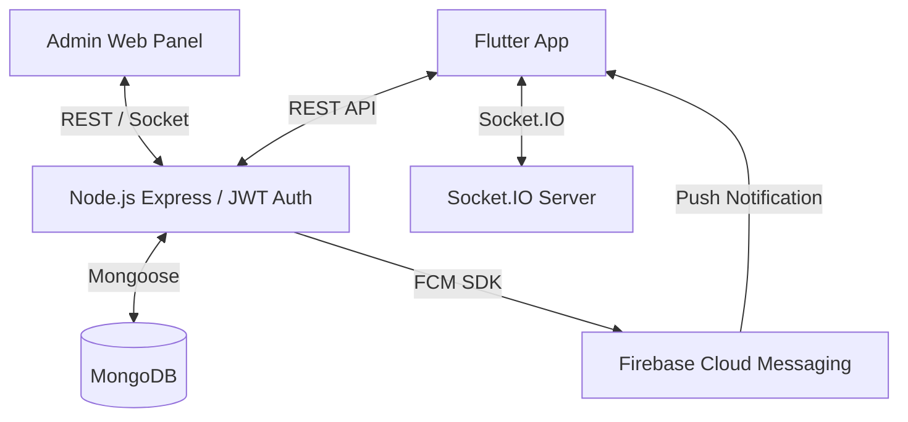

# Smart Queue Management System - Architecture & Implementation Plan

This document outlines the complete system architecture, database schema, API design, real-time event flow, and implementation plan for the Smart Queue Management System (SQMS).

## 1. Complete System Architecture

### Core Components
- **Mobile App (Flutter)**: Client-facing Android-first app with a dark theme by default. Communicates via REST for standard operations and Socket.IO for live queue status.
- **Backend (Node.js/Express)**: Centralized logic, handles API requests, orchestrates real-time Socket updates, and manages FCM push notifications.
- **Database (MongoDB)**: NoSQL database storing user profiles, tokens, queues, and historical data.
- **Admin Panel (Web)**: Web-based dashboard for counter staff to progress the queue and view analytics. Includes a TV/monitor display mode.

### Data Flow Diagram (Conceptual)

## 2. MongoDB Database Schema

*Designed for scalability and fast queries on active queues.*

#### `users`
- `_id`: ObjectId
- `phone`: String (Unique) / `email`: String (Optional)
- `name`: String
- `fcmTokens`: Array of Strings (for push notifications)
- `createdAt`: Date

#### `queues` (Services/Departments)
- `_id`: ObjectId
- `name`: String (e.g., "General Checkup", "Billing")
- `code`: String (e.g., "GN", "BL")
- `isActive`: Boolean
- `avgWaitTimePerToken`: Number (in minutes)

#### `counters`
- `_id`: ObjectId
- `name`: String (e.g., "Counter 1", "Emergency")
- `status`: Enum [`ACTIVE`, `PAUSED`, `CLOSED`]
- `assignedAdminId`: ObjectId (Ref `admins`)

#### `tokens` (The Core Queue Items)
- `_id`: ObjectId
- `userId`: ObjectId (Ref `users`)
- `queueId`: ObjectId (Ref `queues`)
- `tokenNumber`: String (e.g., "GN-105")
- `status`: Enum [`WAITING`, `SERVING`, `COMPLETED`, `CANCELLED`, `NO_SHOW`]
- `priority`: Enum [`NORMAL`, `SENIOR`, `EMERGENCY`]  // Weighted sorting
- `counterId`: ObjectId (Ref `counters`, null until SERVING)
- `joinedAt`: Date
- `servedAt`: Date (When called)
- `completedAt`: Date
- `estimatedWaitTime`: Number (calculated at generation)

## 3. REST API Endpoints

### User API (`/api/v1/user`)
- `POST /auth/login` - Login/OTP validation.
- `POST /auth/fcm-token` - Register device FCM token.
- `GET /queues` - List available queues and their current status.
- `POST /tokens/generate` - Generate a new token (Supports priority & QR params).
- `GET /tokens/active` - Get the user's currently active token(s) and live position.
- `GET /tokens/history` - User's past token history.
- `POST /tokens/:id/cancel` - Cancel a token.

### Admin API (`/api/v1/admin`)
- `POST /auth/login` - Admin authentication.
- `GET /counters` - List all counters.
- `PUT /counters/:id/status` - Pauses/activates counter.
- `POST /counters/:id/call-next` - Calls the next user in priority order.
- `POST /counters/:id/complete` - Marks current serving token as COMPLETED.
- `POST /counters/:id/no-show` - Marks token as NO_SHOW after waiting.
- `GET /analytics/daily` - Stats for tokens served, average wait times.

## 4. Socket.IO Real-time Event Flow

**Namespace / Rooms:** Users join a Socket room based on their active `queueId`.

- **Client Emits:**
  - `join_queue`: Payload `{ queueId, userId }`. Subscribes user to live updates.
- **Server Emits:**
  - `queue_updated`: Broadcasted to all in `queue_ROOM_ID`. Payload: `{ currentTokenServing: "GN-105", counter: "Counter 1" }`.
  - `token_status_changed`: Directed to a specific user. Payload: `{ tokenId, newStatus: "SERVING", counterId }`.
  - `wait_time_update`: Periodic broadcast adjusting estimated wait times.

## 5. Flutter Screen List & Widget Structure

*Using Bottom Navigation Bar pattern and Dark Mode default.*

### Screen Flow
- **`SplashScreen`** -> Checks auth, theme, & deep links.
- **`AuthScreen`** -> Phone/Email input & OTP verification.
- **`MainBottomNavScreen`** (Holds BottomNavigationBar)
  - **Tab 1: `HomeScreen`** (Hero widget for active token status, queue dashboard).
  - **Tab 2: `QueueSelectionScreen`** (Select queue department, choose priority, generate token).
  - **Tab 3: `QRScanScreen`** (QR scanner. Scans physical QR at location to join queue directly).
  - **Tab 4: `TokenHistoryScreen`** (Paginated list of past tokens).
  - **Tab 5: `ProfileScreen`** (Settings, edit profile, logout).

### Key Reusable Widgets (`/lib/widgets/`)
- `ActiveTokenCard`: Soft pastel glowing dark card showing token number, current status, and countdown.
- `QueueCategoryListTile`: Shows queue name and live "X people waiting" counts.
- `PrioritySegmentedSelector`: UI component to toggle between Normal/Senior Citizen/Emergency.
- `PrimaryButton`: Reusable CTA with async loading state management.

## 6. Admin Panel Page Flow & UI Structure

### Flow
- **Login screen** -> **Dashboard**
- **Dashboard**:
  - Top: Aggregate metric cards (Total tokens today, Serving, Waiting).
  - Middle: Grid of Counters. Click to jump into control mode.
- **Counter Controller View**:
  - Big text of "Currently Serving: GN-104".
  - Actions: `[ Complete ]`, `[ No Show ]`.
  - Huge CTA Button: `[ CALL NEXT TOKEN ]`.
  - Sidebar: List of next 5 upcoming tokens (visually highlights VIP/Priority patients).
- **Fullscreen TV Display Mode (`/tv-display`)**:
  - Left 70%: Large grid showing active lines `[Counter 1] -> [GN-104]` etc.
  - Right 30%: Upcoming next 5 tokens.
  - *UX Detail*: Screen flashes subtly / bell rings when a new token is socket-broadcasted.

## 7. Push Notification Logic (FCM)

**Trigger Point**: Event fires when Admin hits `POST /counters/:id/call-next`.
**Logic Engine**:
1. Token `GN-104` is called. Backend updates state and emits socket events.
2. Backend queries the DB for the next WAITING tokens in logic order.
3. Retrieves the user who is at **Queue Position #4** (meaning exactly 3 tokens left ahead of them).
4. If they have `fcmTokens`, sends FCM Notification:
   - *Title*: "Your turn is approaching! 🔔"
   - *Body*: "There are only 3 people ahead of you for General Checkup. Please head towards the waiting area."
5. Also, fetches the user for `GN-104` (the one just called).
6. Sends FCM Notification:
   - *Title*: "It's your turn! ✅"
   - *Body*: "Token GN-104. Please proceed to Counter 1 immediately."

## 8. Security Best Practices

1. **Authentication**: Use JWTs. The mobile app utilizes short-lived Access Tokens (15m) alongside secure HTTP-only cookie Refresh Tokens.
2. **Rate Limiting**:
   - Apply `express-rate-limit` on `/tokens/generate` to prevent queue spamming (e.g., max 1 active token per user across all queues).
3. **Socket Security**:
   - Socket handshakes must include the JWT auth token. Map socket IDs to User IDs to ensure users only get metadata they are granted permission for.
4. **Data Sanitization**:
   - Use `zod` or `Joi` middlewares to validate incoming objects for REST routes.
   - Prevent NoSQL Injection attacks by strictly casting target IDs via `mongoose.Types.ObjectId`.

## 9. Step-by-Step Implementation Plan

Follow this progression path to start building:
- **Phase 1: Foundation Setup (Backend/DB)**
  - Setup Node.js Express repo with robust error handling and basic MongoDB schemas.
  - Setup authentication flow (JWT + Auth Models).
- **Phase 2: Core Queue System API**
  - Implement dynamic token generation based on priorities.
  - Build Admin functionality controllers (Call Next -> status mutations).
- **Phase 3: WebSockets & FCM Infrastructure**
  - Add Socket.io namespaces and handlers into Node backend.
  - Add Firebase Admin SDK backend integrations, implementing the "Pos #4" calculation hook.
- **Phase 4: Flutter Application (The Client)**
  - Configure Flutter environment with standard structural folders (screens, widgets, hooks).
  - Finalize Dark Theme implementation. Address token WebSocket hooks.
- **Phase 5: Admin Metrics Dashboard**
  - Implement standard Vue JS/React JS structure to hit Counter APIs. Add the Display/Monitor mode layouts.
