# SQMS — Smart Queue Management System 🚀

SQMS is a premium, full-stack queue management ecosystem designed for modern businesses. It features a high-performance **Flutter mobile app**, a sleek **Glassmorphic Admin Dashboard**, and a **Futuristic TV Display** for live status tracking.


---

## ✨ Key Features

### 🤳 User Mobile App (Flutter)
- **Smart Queue Joining**: Scan a QR code to join the queue instantly.
- **Live Position Tracking**: Real-time updates on your position and estimated wait time.
- **Priority Selective**: Support for **Emergency**, **Senior**, and **General** categories.
- **Smart Notifications**: Push notifications via FCM when your turn is approaching.
- **Premium UI**: Modern dark theme with `Tomorrow` typography and glassmorphic elements.

### 🛡️ Admin Panel (Web)
- **Counter Management**: Open/Close/Pause service counters.
- **Intelligent Calling**: A "Call Next" system that respects strict priority levels.
- **Real-time Oversight**: Monitor waiting lists and active tokens in one view.
- **Secure Access**: Email/Password authenticated administrative portal.

### 📺 Live TV Display (Web)
- **Futuristic Visualization**: Designed for large screens in waiting areas.
- **Neon Indicators**: High-visibility "Now Serving" numbers with neon glow.
- **Live Sync**: Updates within seconds without manual refresh.

---

## 🏗️ Conceptual Architecture

The SQMS ecosystem is built on a centralized service-oriented architecture, ensuring real-time synchronization between all touchpoints.

### System Workflow

```mermaid
graph TD
    subgraph "Actors"
        Customer["📱 Customer (App)"]
        Admin["👨‍💼 Admin (Web)"]
        TV["📺 Public TV"]
    end

    subgraph "Backend Tier (Node.js/Express)"
        API["REST API Layer"]
        Auth["Auth Service (JWT/Bcrypt)"]
        Queue["Queue Logic (FCM Engine)"]
    end

    subgraph "Data & Cloud"
        DB[("MongoDB Atlas")]
        FCM["Firebase Notifications"]
    end

    %% Interactions
    Customer -- "Join Queue / Track Position" --> API
    Admin -- "Call Next / Manage Status" --> API
    API -- "CRUD Operations" --> DB
    Queue -- "Priority Tokens" --> DB
    API -- "Trigger Alerts" --> Queue
    Queue -- "Push Notification" --> FCM
    FCM -- "Alert Turn" --> Customer
    TV -- "Poll Active Status" --> API
```


---

## 🛠️ Technology Stack

| Component | Technology |
| :--- | :--- |
| **Mobile App** | Flutter, Provider, Google Fonts, HTTP, Shared Preferences |
| **Backend** | Node.js, Express, Mongoose, JWT, BcryptJS |
| **Database** | MongoDB Atlas (Cloud) |
| **Styling** | Vanilla CSS, Tailwind CSS (Admin/TV) |
| **Notifications** | Firebase Cloud Messaging (FCM) |
| **Deployment** | Vercel (Backend/Admin) |

---

## 🚀 Getting Started

### 1. Backend Setup
```bash
# Navigate to backend
cd backend

# Install dependencies
npm install

# Configure Environment (.env)
PORT=5000
MONGO_URI=your_mongodb_atlas_uri
JWT_SECRET=your_secure_secret

# Start Server
npm start
```

### 2. Flutter App Setup
```bash
# Get dependencies
flutter pub get

# Generate Launcher Icons & Splash (Optional)
dart run flutter_launcher_icons
dart run flutter_native_splash:create

# Run the app
flutter run
```

---

## ⚖️ Priority Queuing Logic
The system enforces a strict priority flow to ensure critical cases are handled first:
1.  **Emergency** (Highest Priority)
2.  **Senior Citizens**
3.  **General** (Standard)

---

## 🔑 Default Credentials (First Launch)
After the first backend deployment, a default admin is automatically created:
- **Email**: `admin@sqms.com`
- **Password**: `admin123`

---

## 🎨 Design Philosophy
SQMS follows a **Premium Dark** aesthetic, utilizing:
- **Glassmorphism**: Transparent surfaces with 20px backdrop blur.
- **Tomorrow Font**: A tech-inspired, futuristic typeface for branding.
- **Vibrant Accents**: Electric Blue for general actions and Neon Purple for secondary highlights.

---

## 📄 License
This project is licensed under the MIT License - see the [LICENSE](LICENSE) file for details.

Developed with ❤️ for a smarter waiting experience.
