# SQMS — Smart Queue Management System 🚀

SQMS is a premium, full-stack queue management ecosystem designed for modern businesses. It features a high-performance **Flutter mobile app**, a sleek **Glassmorphic Admin Dashboard**, and a **Futuristic TV Display** for live status tracking.


---

## 🖼️ Visual Showcase

| User Mobile App | Admin Dashboard |
| :---: | :---: |
|  |  |
| *Premium dark theme with real-time tracking.* | *Glassmorphic control center for staff.* |

| Management Panel | TV Public Display |
| :---: | :---: |
|  |  |
| *Advanced CRUD for staff, counters, and services.* | *Futuristic live status for waiting areas.* |

---

## ✨ Key Features

### 🤳 User Mobile App (Flutter)
- **Smart Queue Joining**: Scan a QR code to join the queue instantly.
- **Live Position Tracking**: Real-time updates on your position and estimated wait time.
- **Priority Selective**: Support for **Emergency**, **Senior**, **General**, and **Normal** categories.
- **Battery-Safe Scanner**: Optimized camera lifecycle that shuts down automatically when not in use.
- **Smart Notifications**: Push notifications via FCM when your turn is approaching.
- **Premium UI**: Modern dark theme with `Tomorrow` typography and glassmorphic elements.

### 🛡️ Admin Panel (Web)
- **Role-Based Access**: Specialized dashboards for **Administrators** and **Staff Members**.
- **Counter Management**: Assign specific staff members to counters and control their status.
- **Service-Level Restrictions**: Strictly assign counters to one or more specific services.
- **Style Resilience**: Robust UI that maintains stability even under poor network conditions.
- **Real-time Oversight**: Monitor waiting lists and active tokens in one view.

### 📺 Live TV Display (Web)
- **Futuristic Visualization**: Designed for large screens in waiting areas.
- **Neon Indicators**: High-visibility "Now Serving" numbers with neon glow.
- **Live Sync**: Updates within seconds without manual refresh.

---

## 🏗️ Conceptual Architecture

The SQMS ecosystem is built on a centralized service-oriented architecture, ensuring real-time synchronization between all touchpoints.

### System Workflow

```mermaid
graph TD
    subgraph "Actors"
        Customer["📱 Customer (App)"]
        Admin["👨‍💼 Admin (Web)"]
        Staff["🧑‍💻 Staff (Web)"]
        TV["📺 Public TV"]
    end

    subgraph "Backend Tier (Node.js/Express)"
        API["REST API Layer"]
        Auth["Auth Service (JWT/Bcrypt)"]
        Queue["Queue Logic (FCM Engine)"]
    end

    subgraph "Data & Cloud"
        DB[("MongoDB Atlas")]
        FCM["Firebase Notifications"]
    end

    %% Interactions
    Customer -- "Join Queue / Track Position" --> API
    Admin -- "Call Next / Manage Status" --> API
    API -- "CRUD Operations" --> DB
    Queue -- "Priority Tokens" --> DB
    API -- "Trigger Alerts" --> Queue
    Queue -- "Push Notification" --> FCM
    FCM -- "Alert Turn" --> Customer
    TV -- "Poll Active Status" --> API
```


---

## 🛠️ Technology Stack

| Component | Technology |
| :--- | :--- |
| **Mobile App** | Flutter, Provider, Google Fonts, HTTP, Shared Preferences |
| **Backend** | Node.js, Express, Mongoose, JWT, BcryptJS |
| **Database** | MongoDB Atlas (Cloud) |
| **Styling** | Vanilla CSS, Tailwind CSS (Admin/TV) |
| **Notifications** | Firebase Cloud Messaging (FCM) |
| **Deployment** | Vercel (Backend/Admin) |

---

## 🚀 Getting Started

### 1. Backend Setup
```bash
# Navigate to backend
cd backend

# Install dependencies
npm install

# Configure Environment (.env)
PORT=5000
MONGO_URI=your_mongodb_atlas_uri
JWT_SECRET=your_secure_secret

# Start Server
npm start
```

### 2. Flutter App Setup
```bash
# Get dependencies
flutter pub get

# Generate Launcher Icons & Splash (Optional)
dart run flutter_launcher_icons
dart run flutter_native_splash:create

# Run the app
flutter run
```

---

## ⚖️ Priority Queuing Logic
The system enforces a strict priority flow to ensure critical cases are handled first:
1.  **Emergency** (Highest Priority)
2.  **Senior Citizens**
3.  **General** (Standard)
4.  **Normal** (Default)

---

## ⚙️ Admin & Staff Management Workflow

The SQMS ecosystem provides a robust management layer for supervisors:

1.  **Service Configuration**: Define service categories (e.g., "General Inquiries", "Account Support") and assign them a unique prefix (GN, AC) and priority level.
2.  **Staff Onboarding**: Create Staff accounts via the Management Panel. These users have restricted access to the system.
3.  **Counter Assignment**: 
    - Create a Counter (e.g., "Station 01").
    - **Link Staff**: Assign a specific Staff member to the counter.
    - **Link Services**: Select one or more Services that this counter is authorized to serve.
4.  **Operational Cycle**:
    - **Staff Login**: Staff members log in to see their specific counter dashboard.
    - **Call Next**: The system automatically pulls the highest-priority token from the authorized service list.
    - **TV Sync**: The public display updates instantly to direct the customer to the correct station.

## 🔑 Default Credentials (First Launch)
After the first backend deployment, a default admin is automatically created:
- **Email**: `admin@sqms.com`
- **Password**: `admin123`

---

## 🎨 Design Philosophy
SQMS follows a **Premium Dark** aesthetic, utilizing:
- **Glassmorphism**: Transparent surfaces with 20px backdrop blur.
- **Tomorrow Font**: A tech-inspired, futuristic typeface for branding.
- **Vibrant Accents**: Electric Blue for general actions and Neon Purple for secondary highlights.

---

## 📄 License
This project is licensed under the MIT License - see the [LICENSE](LICENSE) file for details.

Developed with ❤️ for a smarter waiting experience.
