# SQMS - Smart Queue Management System 🚀

SQMS is a high-end, easy-to-use system for managing customer queues. It includes a **Mobile App** for customers, a **Control Panel** for staff, and a **Live TV Display** for waiting areas.


---

## 🖼️ Visual Showcase

| **Customer Mobile App** | **Staff Control Panel** |
| :---: | :---: |
|  |  |
| *Easy tracking for customers.* | *Simple controls for staff.* |

| **Management Settings** | **Public TV Display** |
| :---: | :---: |
|  |  |
| *Setup services and staff.* | *Clear view for waiting areas.* |

---

## ✨ Best Features

### 🤳 For Customers (Mobile App)
- **Fast Join**: Scan a QR code to join the line instantly.
- **Live Updates**: See your position and wait time in real-time.
- **Smart Alerts**: Get a notification when it is almost your turn.
- **Battery Saver**: The camera turns off automatically when not needed.

### 🛡️ For Staff & Admins (Web Panel)
- **Role System**: Separate dashboards for Admins and Staff.
- **Easy Calling**: One click to call the next person based on priority.
- **Smart Filters**: Staff only see the services they are assigned to.
- **Stable Design**: Works perfectly even if the internet is slow.

### 📺 For Waiting Areas (TV Display)
- **Big & Clear**: High-visibility numbers so everyone can see.
- **Live Sync**: Numbers update instantly when someone is called.
- **Smooth Moves**: Professional animations for a premium feel.

---

## 🏗️ How It Works

The system connects customers, staff, and the TV display through a fast cloud server.

```mermaid
graph TD
    subgraph "Users"
        Customer["📱 Customer (App)"]
        Admin["👨‍💼 Admin (Web)"]
        Staff["🧑‍💻 Staff (Web)"]
        TV["📺 Public TV"]
    end

    subgraph "Server (Node.js)"
        API["API Layer"]
        Logic["Queue & Priority Logic"]
    end

    subgraph "Cloud Data"
        DB[("MongoDB DB")]
        FCM["Push Notifications"]
    end

    Customer -- "Join Queue" --> API
    Admin -- "Manage System" --> API
    Staff -- "Call Next" --> API
    API -- "Store Data" --> DB
    API -- "Notify" --> FCM
    FCM -- "Alert" --> Customer
    TV -- "Update View" --> API
```



---

## ⚙️ Simple Setup Guide

### 1. Start the Server
```bash
cd backend
npm install
# Add your MONGO_URI and JWT_SECRET to .env
npm start
```

### 2. Start the App
```bash
flutter pub get
flutter run
```

---

## ⚖️ Priority Levels
The system automatically handles different customer types:
1.  **🔴 Emergency**: Highest priority.
2.  **🟡 Senior Citizens**: High priority.
3.  **🟢 General**: Standard priority.
4.  **⚪ Normal**: Default priority.

---

## 📖 Management Process (Step-by-Step)

Managing your queue system is easy with these 4 steps:

1.  **Add Services**: Create categories like "Billing" or "Support".
2.  **Add Staff**: Create accounts for your team members.
3.  **Assign Counters**: Setup stations (e.g., Counter 1) and link a staff member to it.
4.  **Go Live**: Staff log in, call customers, and the TV display updates automatically!

---

## 🔑 Default Login
- **Admin Email**: `admin@sqms.com`
- **Admin Password**: `admin123`

---

## 👥 Contributors

This project was built with ❤️ by:

- **[Shakib Hossain](https://shakib.me/)**
- **Samiul Kabir**
- **Puranpreet Singh**

**Mentor:** **Rohin Gupta**

---

## 📄 License
This project is licensed under the MIT License.
